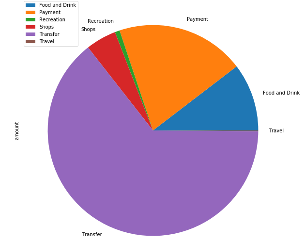
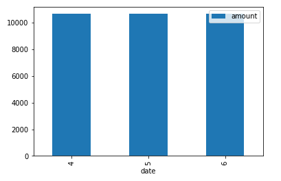
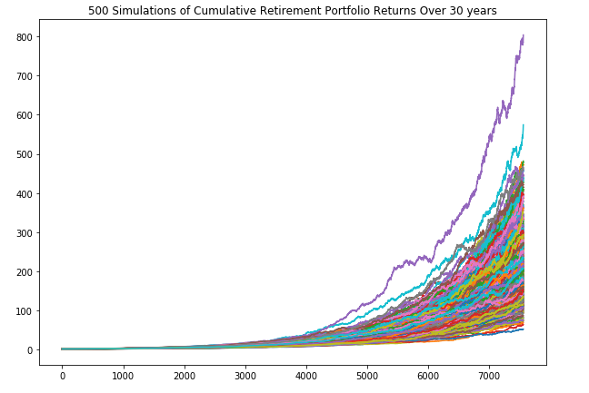
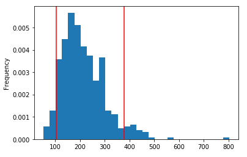
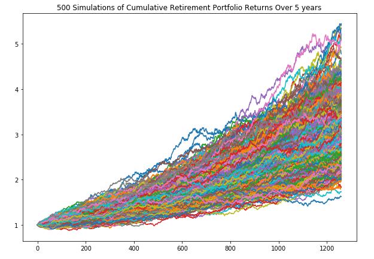
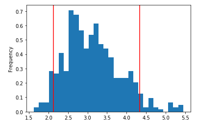

# Financial Report

## Budget Analysis
With the information provided by our client, we have compiled a short sumamry of their income and analyzed it to provide further value.
* Previous year's income =  $6,000
* Previous year's income before tax = $7,285
* Projected yearly income = $6,085
* Projected yearly income before tax = $7,389

Our client has the following expenses over a period of 3 months:

| category       | amount   |
|----------------|----------|
| Food and Drink | 3317.19  |
| Payment        | 6310.50  |
| Recreation     | 235.50   |
| Shops          | 1500.00  |
| Transfer       | 20537.34 |
| Travel         | 35.19    |
Please note: Transfer = Credit card expenses

Here is a graphical description depicting the same:

As we delve deeper, we find that our client has the exact same expenses every month.

## Retirement Planning
Using the Monte Carlo model, we were able to simulate 500 predictions of what our client's cumulative retirement portfolio returns could be over the next 30 years.
Our portfolio consists of 1 stock - AGG (60%) and 1 bond - SPY (40%) from the Alpaca API.

We are able to say with a certainty of 90% that cumulative returns would range between $98.59 and $376.52 over the next 30 years.

At our client's request, we did another analysis with a 5 year timeline and a higher investment of $40,000. We came up with the following analysis:

Unfortunately, 5 years is simply too short a time to amass that amount of wealth for that many years of retirement. Even with a 80:20 stock-bond portfolio and an initial investment that is more than double, the client would not be able to save enough to retire.
Investing completely in stocks would be too risky and is therefore, not advisable.
